# 	                        领军者Mobile站

> 项目开源 可商用 本次开源经过公司同意

## 技术栈

1. Node

2. Element

3. Vue

4. Let’s Encrypt 启用 SLL 安全证书 部署 https

5. Aliyun-Oss 对象存储

6. 前后端分离

   一些小细节小技术就不赘述了 没意义

   ## 后端页

| 登录页                               | 主页                                  |
| ------------------------------------ | ------------------------------------- |
| 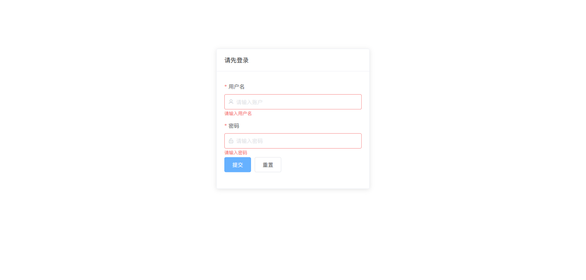 | 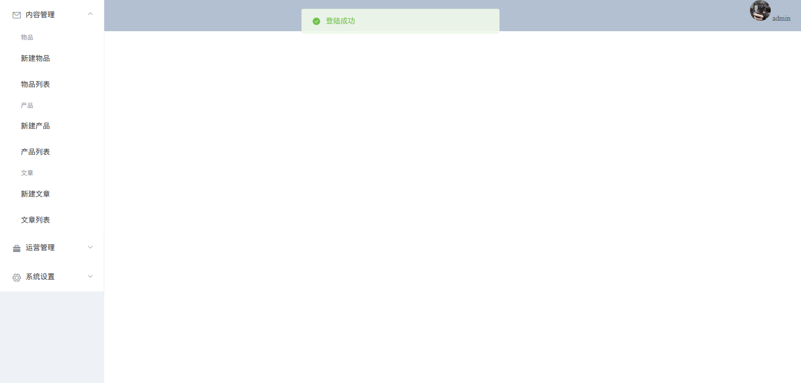 |

| 文章页                                | 产品编辑页                            |
| ------------------------------------- | ------------------------------------- |
| 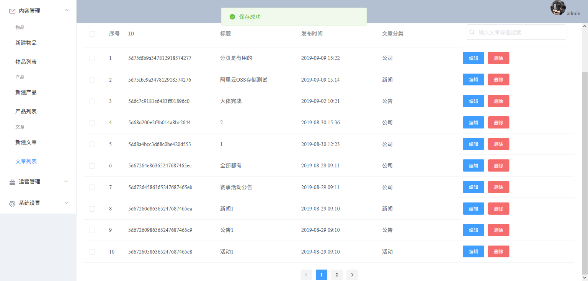 | 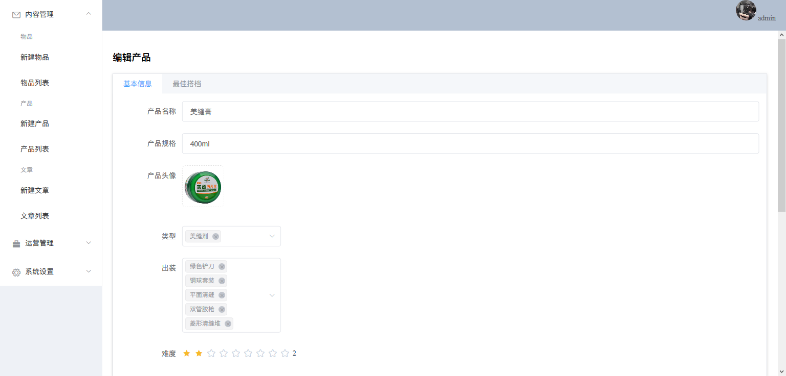 |

| 文章编辑页                            | 轮播图编辑页                          |
| ------------------------------------- | ------------------------------------- |
| 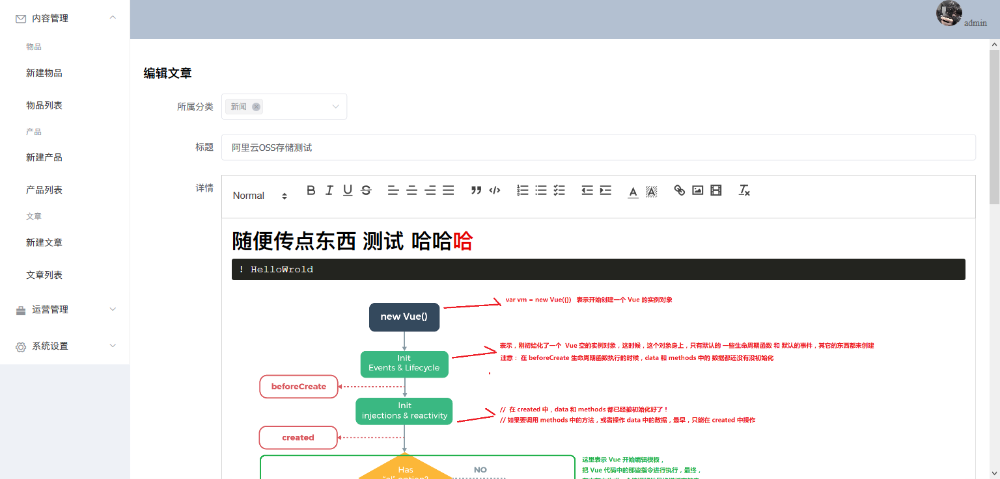 | 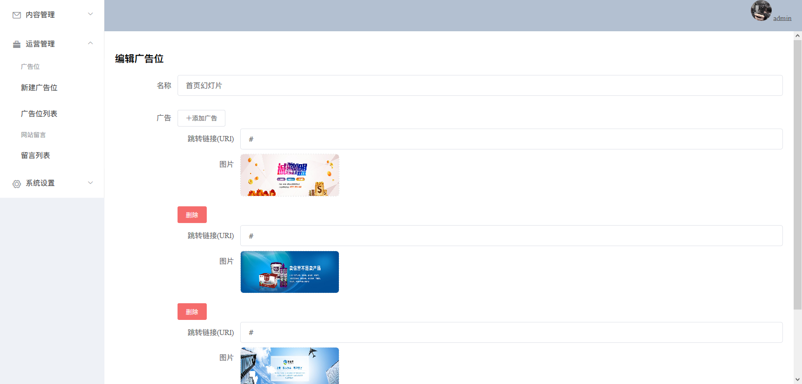 |

| 管理员新建页                          |
| ------------------------------------- |
| 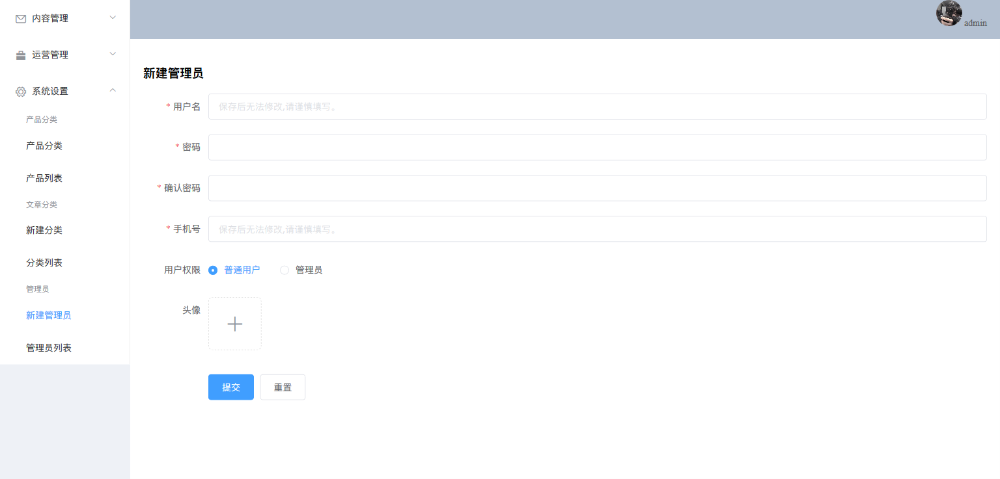 |

## 前端页

| 主页                               | 主页                                |
| ---------------------------------- | ----------------------------------- |
| 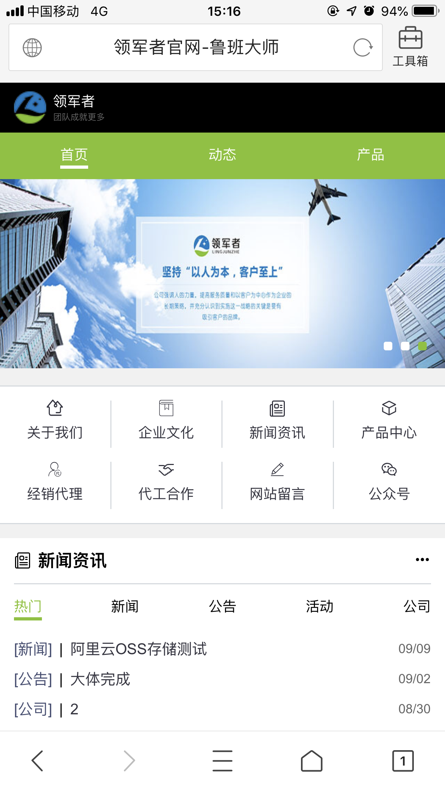 | 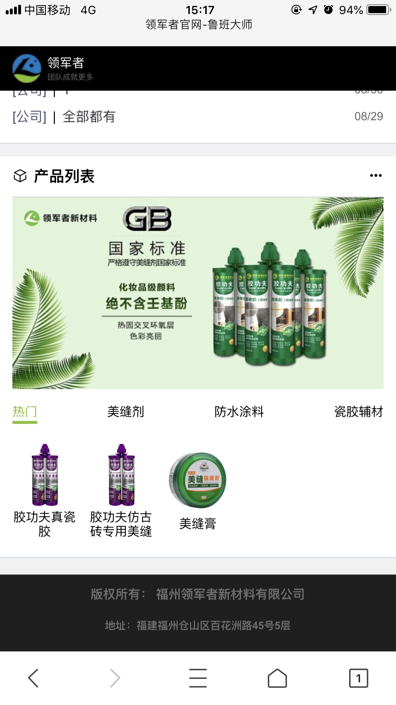 |

| 文章页                              | 文章页                              |
| ----------------------------------- | ----------------------------------- |
| 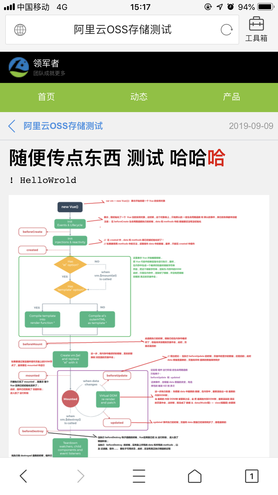 | 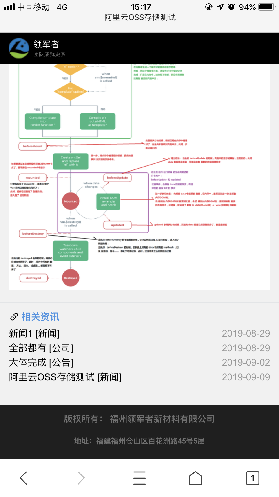 |

| 文章页                              | 产品页                              |
| ----------------------------------- | ----------------------------------- |
| 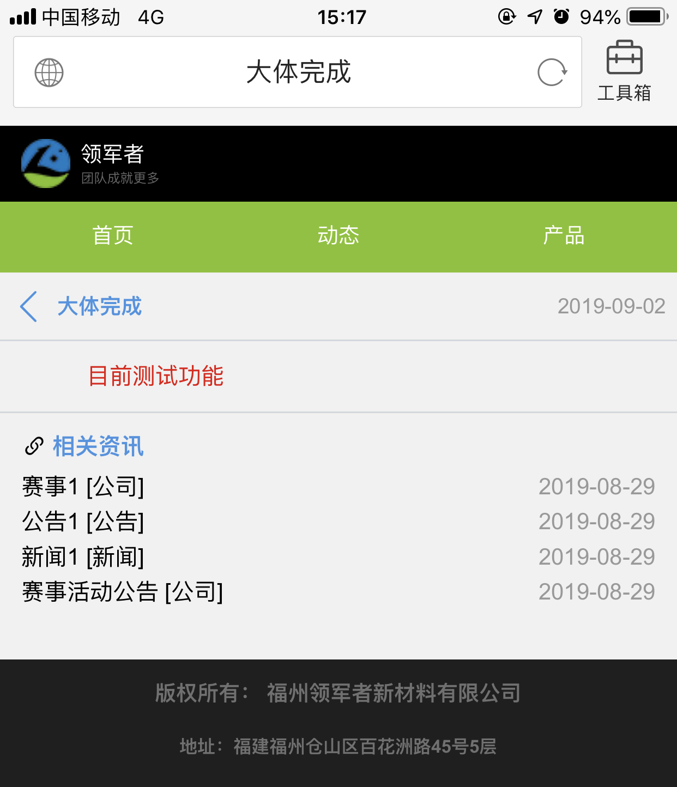 | 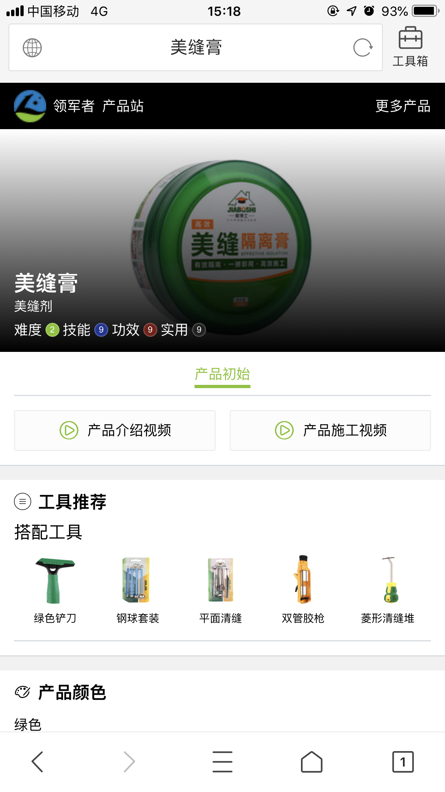 |

| 产品页                              |
| ----------------------------------- |
| 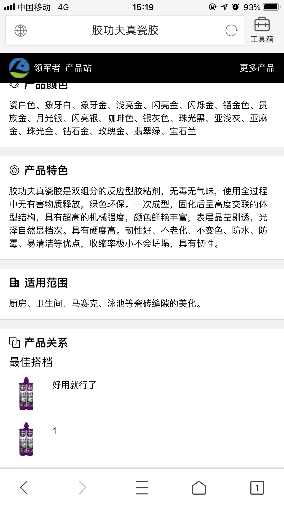 |

